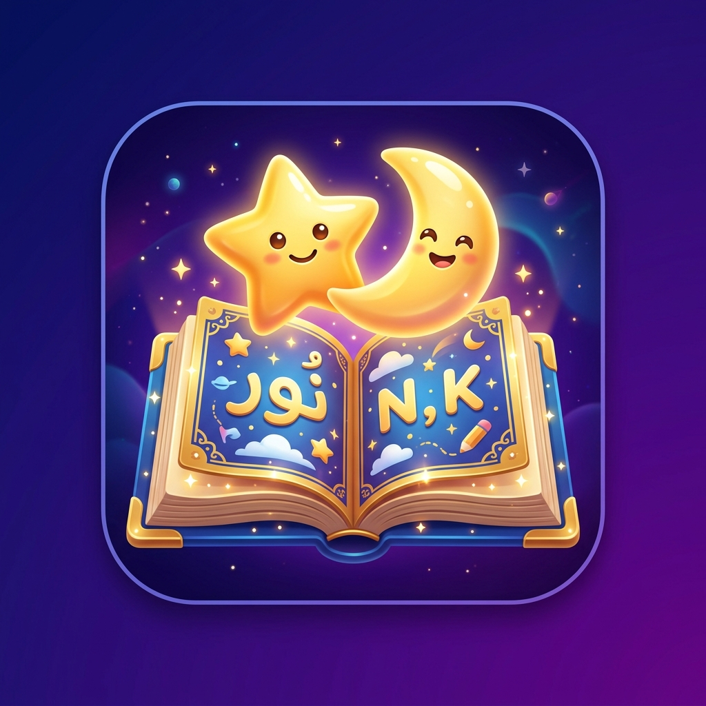

# 🌙 NoorKids



**An Islamic storytelling app for children where kids can read, listen to, and ask questions about the stories of the Prophets, in Urdu and English.**

[](https://react.dev/)
[](https://nodejs.org/)
[](https://supabase.com/)
[](https://groq.com/)
[](https://tailwindcss.com/)
[](./LICENSE)

## 📖 About

NoorKids is a children's app built around a collection of Prophet stories including Hazrat Adam, Nuh, Ibrahim, Musa, Yousaf, Suleman, and many more. Every story can be read on screen, listened to as narrated Urdu audio, discussed with an AI companion that answers questions about that specific story, and reviewed through a short quiz. The app also keeps track of what each child has read so far and how much time they have spent reading.

It is built for two kinds of people at once. Children around five to ten years old will use it directly, and parents will want to feel confident it is trustworthy, well made, and worth their child's time.

## ✨ Features

📚 A growing library of Prophet stories written in Urdu, with English titles and categories so parents can browse easily.

🤖 An AI companion named Noor that a child can chat with after reading a story. It only answers using that story's own content, in a warm and gentle tone suited to young children.

🔊 A listen feature that plays natural Urdu narration for each story, with the ability to pause, seek, and change the playback speed.

📝 A short quiz for every story, generated from the story's own content, with instant feedback and a final score.

📊 Progress tracking that remembers the last story a child read, how much of each story they have completed, and their total reading time.

🔐 Accounts and profiles, including email sign up and Google sign in, along with a short profile setup step for each child.

🛠️ An admin panel, separate from the main app, where new stories can be uploaded and registered users can be reviewed.

## 🧰 Tech Stack

| Layer | Technology |
|---|---|
| Frontend | React 19, Vite, Tailwind CSS v4, React Router v7 |
| Backend | Node.js and Express |
| Database and Auth | Supabase, using Postgres, Auth, and Row Level Security |
| AI and Chat | Groq API (llama-3.3-70b-versatile) |
| Text to Speech | Google Cloud TTS (Free Node API) for Urdu voices |
| Document Parsing | mammoth for docx files, pdf-parse for PDFs |

## 📸 Screenshots

You can add screenshots or a short demo clip here once the interface is finished, for example under a folder like docs/screenshots.

## 🚀 Getting Started (For Partners & Developers)

### What you will need

You will need Node.js version 18 or later, a free Supabase project, and a Groq API key.

### Installing the project

```bash
git clone https://github.com/OwaisTanoli71/noorkids-app.git
cd NoorKidsApp

cd client
npm install

cd ../server
npm install
```

### Setting up your environment variables

Your repository contains `.env.example` files. You must duplicate them and rename them to `.env`.

Create `.env` inside the `client` folder with the following:

```env
VITE_SUPABASE_URL=your_supabase_project_url
VITE_SUPABASE_ANON_KEY=your_supabase_anon_key
```

Create `.env` inside the `server` folder with the following:

```env
GROQ_API_KEY=your_groq_api_key
```

Please keep both of these files private and out of version control. They are already listed in `.gitignore`.

### Setting up the database

This project uses a shared Supabase database. As long as you have the correct `VITE_SUPABASE_URL` and `VITE_SUPABASE_ANON_KEY` in your client `.env` file, the app will automatically connect to the database!

### Adding and processing stories

New stories are added as `.docx` or `.pdf` files inside the `stories` folder at the root of the project. Once a story is added, run the following from inside the `server` folder:

```bash
npm run build:stories
npm run build:quizzes
npm run build:audio
```

These three commands read the story text, build the search index the AI companion uses, generate a quiz using Groq, and generate the narrated audio using Google TTS.

### Running the app

Run the server from inside the server folder and the client from inside the client folder, each in its own terminal:

```bash
npm run dev
```

By default the client will run at http://localhost:5173 and the server at http://localhost:5000.

## 📁 Project Structure

```
NoorKidsApp
  stories                 the original story docx files
  client                  the React frontend
    src
      pages
      components
      admin               the admin panel
      context
      hooks
      services
  server                  the Express backend
    routes
    controllers
    scripts               the story, quiz, and audio pipeline
    output                generated story indexes, quizzes, and audio files
  supabase
    schema.sql
```

## 🗺️ Roadmap

Support for languages beyond Urdu and English.

Downloadable audio so stories can be listened to offline.

Weekly progress summaries for parents.

More story categories beyond the Prophets.

## 🤝 Contributing

Contributions are always welcome. Please open an issue first so we can talk through the idea before you send a pull request.

## 📄 License

This project is licensed under the MIT License. See the LICENSE file for details.

## 🙏 Acknowledgments

Built to help children connect with the stories of the Prophets in a way that feels engaging for them and trustworthy to the parents watching over their learning.
